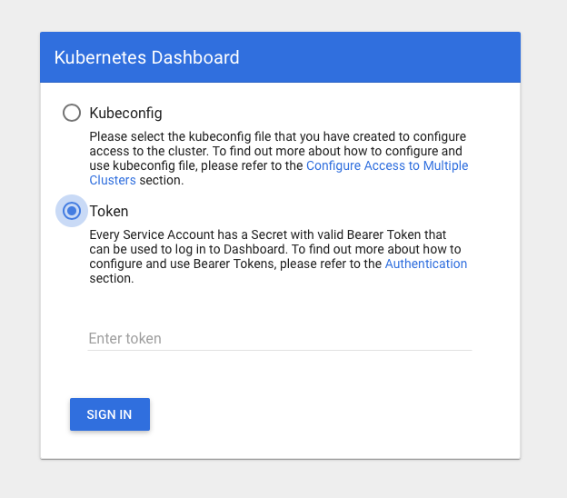
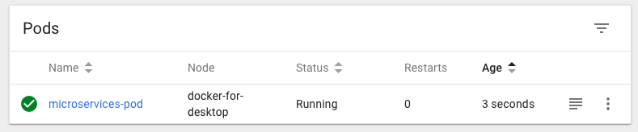

* auto-gen TOC:
{:toc}

This post is based on [Hosting a .NET Core Web API service in a docker container](../micros-services-part-1)

# What is Kubernetes?
Kubernetes is a container orchestrator. In the previous post we created a micro service and a docker image. We had to start the image instance/container manually, which can get at least tiresome if we have multiple images to start each time we want to spin up our app. Kubernetes allows us to just define the images that our app consists of and than handles starting and stopping for us. Moreover it can handle scaling for us, more on this in a later post.

# Setting up Kubernetes
First we install the command-line tool to run commands against our Kubernetes cluster.
```shell
brew install kubernetes-cli         # installation is easy w/ Homebrew

kubectl version                     # let's check the version
> Client Version: version.Info{Major:"1", Minor:"15", GitVersion:"v1.15.0"[...]
```
Additionally we install the dashboard to get a Web-UI.
```shell
kubectl apply -f https://raw.githubusercontent.com/kubernetes/dashboard/v1.10.1/src/deploy/recommended/kubernetes-dashboard.yaml
```

To start the dashboard we run
```shell
kubectl proxy
> Starting to serve on 127.0.0.1:8001
```
and open the following URL in our browser.
`http://localhost:8001/api/v1/namespaces/kube-system/services/https:kubernetes-dashboard:/proxy/#!/login`
This will show a login page. There are multiple ways to login, we can even disable the login. For now we'll use a token, so we select token and generate a token in the terminal.



> **Disclaimer**  
> I'm learning as I go, so: mabye don't use this in a production environment  
> I'll update this page with definitive information whether this is save as or not as soon as I know better.

```shell
kubectl -n kube-system get secret
> NAME                                             TYPE                                  DATA   AGE
> attachdetach-controller-token-sb24l              kubernetes.io/service-account-token   3      8d
...
> deployment-controller-token-2gc2n                kubernetes.io/service-account-token   3      8d
...
```
In the output above we look for a name that starts with `deployment-controller-token-` and use this to get a token.
```shell
kubectl -n kube-system describe secret deployment-controller-token-2gc2n
```
in the output we look for `token:` followed by a rather long string, copy that and paste it into the login page's token field.

# Running Docker containers in Kubernetes
A group of containers that are deployed together on the same host are called a pod. First we create a YAML file to specify the contents of our pod

```yaml
# pod.yaml
kind: Pod
apiVersion: v1
metadata:
  name: microservices-pod
spec:
  containers:
    - image: identity
      name: microservices-containers
      imagePullPolicy: Never
```
and then we apply the pod
```shell
kubectl apply -f pod.yaml
```

and can see it appear in the Kubernetes dashboard

and in the running container list
```shell
docker ps
> CONTAINER ID        IMAGE               COMMAND                  CREATED             STATUS              PORTS               NAMES
> 7e0bf504c98b        4ec6142267e5        "dotnet identity-ser…"   About an hour ago   Up About an hour                        k8s_microservices-containers_microservices-pod_default_6752c2ad-ab97-11e9-9220-025000000001_0
```

```shell
kubectl get pods
NAME                READY   STATUS    RESTARTS   AGE
microservices-pod   1/1     Running   0          54m
```

The only thing we have to do now, is to forward our port 
```shell
kubectl port-forward microservices-pod 8080:80
```

and we should again be able to access our Web API service through `http://localhost:8080/api/values` and get back our two values.
```json
["value1","value2"]
```

Initially I wanted to run multiple instance of the image and dive into the topic of scaling services. But as this post got longer than I expected - even though I skipped a lot of the details - I'll postpone that to a next post.

# References
* [[Youtube] Kubernetes for Beginners - Docker Introduction](https://www.youtube.com/watch?v=rmf04ylI2K0)
* [Install and Set Up kubectl](https://kubernetes.io/docs/tasks/tools/install-kubectl/)